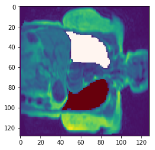
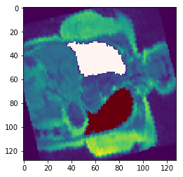

# Unet-ants

This is a self-contained repository for training regression-based or classification-based,
highly-customizable UNET models in Keras. It also lets you train on large 
datasets with augmentation and
without having to load them all directly into memory. All you need
is a CSV with file paths to the images. 

The 3D Data is DLBS (Dallas Lifespan Brain Study?) T1 images and 6-class tissue segmentation.

You can use ANTsPy to load nifti images (much faster), but it also supports loading from Nibabel.

## Scripts

Scripts to train a model are found in the `/code/training/` folder. In particular,
`train_segmentation_augment.py` shows you how to train a Unet segmentation model with 
data augmentation. All it requires is a CSV with file paths.

Additionally, `train_AE_augment.py` shows you how to train a regression-based Unet
with data augmentation. This script is an autoencoder, but you can easily change 
it to predict a different image.

## Example Data Augmentation

Original image:

Rotated image:

## Useful Links
http://theorangeduck.com/page/neural-network-not-working
http://www.samcoope.com/posts/machine_learning_research